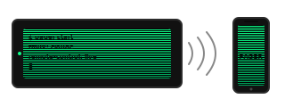

<p align="center">
  <picture>
    <source media="(prefers-color-scheme: dark)" srcset="assets/logo-dark.svg">
    
  </picture>
</p>

<h1 align="center">pager</h1>
<p align="center"><em>Persistent remote-session toolkit for Claude Code</em></p>

<p align="center">
  <a href="LICENSE"></a>
  <a href="https://jawwadzafar.github.io/pager/"></a>
  
  
  
  
</p>

<p align="center">
  <strong><a href="https://jawwadzafar.github.io/pager/">📚 Website &amp; quick-start</a></strong> ·
  <a href="#-the-60-second-phone-walkthrough">walkthrough</a> ·
  <a href="#-install">install</a> ·
  <a href="CHANGELOG.md">changelog</a>
</p>

```
 ██████╗  █████╗  ██████╗ ███████╗██████╗
 ██╔══██╗██╔══██╗██╔════╝ ██╔════╝██╔══██╗
 ██████╔╝███████║██║  ███╗█████╗  ██████╔╝
 ██╔═══╝ ██╔══██║██║   ██║██╔══╝  ██╔══██╗
 ██║     ██║  ██║╚██████╔╝███████╗██║  ██║
 ╚═╝     ╚═╝  ╚═╝ ╚═════╝ ╚══════╝╚═╝  ╚═╝
 remote sessions for Claude Code · MIT
```

## Claude Code that never sleeps.

Claude Code in the browser is great — until your laptop sleeps, your network blinks, or the session quietly times out and your context is gone. **pager runs `claude --remote-control` inside a persistent tmux** on your own always-on Linux box or Mac. **No timeouts. No "session expired." No "please reconnect."** Same session is alive when you wake up tomorrow, when you switch from laptop to phone, when the rig reboots and comes back without you.

Open the URL on **any phone** signed into your claude.ai account and you're inside the same shell, the same context, the same conversation. No SSH tunnel. No port forward. No third-party relay you don't already trust — the only thing in the loop is claude.ai itself.

Works on anything always-on: a Linux mini-PC under the desk, an old Mac mini in the closet, your daily MacBook, a homelab box. Bundles a small inventory-driven SSH helper for operating on your fleet (workstations, home servers, VPSes) from inside the always-on session — credentials read from `.env`, never echoed.

> **Why this exists.** Hermes-style command center, but for Claude Code: a persistent terminal you carry in your pocket.

<p align="center">
  <picture>
    <source media="(prefers-color-scheme: dark)" srcset="assets/flow-dark.svg">
    
  </picture>
</p>

---

## 📱 The 60-second phone walkthrough

```
┌─────────────────┐     ┌─────────────────┐     ┌────────────────────┐
│  Your machine   │     │  claude.ai      │     │  Your phone        │
│  Linux or Mac   │ ◄── │  relay          │ ◄── │  claude.ai/code    │
│                 │     │                 │     │                    │
│  tmux: claude   │     │  session_…      │     │  attached!         │
│  --remote-      │     │                 │     │                    │
│  control        │     │                 │     │                    │
└─────────────────┘     └─────────────────┘     └────────────────────┘
```

1. **Install on your machine (once):**
   ```bash
   curl -fsSL https://raw.githubusercontent.com/jawwadzafar/pager/main/install.sh | sh
   ```
   Installs deps via `apt` (Linux) or `brew` (macOS), wires the shell, registers the service / LaunchAgent. A tmux session named `claude` is already running `claude --remote-control claude --dangerously-skip-permissions`.

2. **Get the URL:**
   ```bash
   pager url
   # → https://claude.ai/code/session_01XXXXXXXXXXXXXX
   ```

3. **Open that URL on your phone** (signed into the same claude.ai account). You're now talking to the same Claude session that lives on your box. Type on phone, type on terminal — both stream to the same conversation.

4. **Detach the local terminal** (don't kill it): `Ctrl-b d`. Claude keeps running. Re-attach any time with `pager attach`.

5. **Reboot the box.** When it comes back, the session is already up. New URL: `pager url` again.

### Want a second session?
```bash
pager start work          # new tmux session named 'work', new remote URL
pager url work         # get its URL
```
Each session is independent — separate context, separate URL, separate log at `~/pager/logs/<name>.log`.

---

## ⚡ Install

**One command. Works on Linux + macOS.**

```bash
curl -fsSL https://raw.githubusercontent.com/jawwadzafar/pager/main/install.sh | sh
```

Detects your OS, checks you have `git`, clones `pager` into `~/.pager`, installs deps (apt on Linux, brew on macOS), wires your shell, **and registers the session to come back at every login**. On macOS that means a LaunchAgent; on Linux a systemd `--user` unit. **First login after install on macOS triggers a one-time stack of TCC permission prompts** — see [`macos/README.md`](macos/README.md#after-first-login-on-macos-what-the-prompts-mean) for what's safe to deny (most of them). **Idempotent** — re-run any time to update.

### Don't want autostart?

```bash
curl -fsSL https://raw.githubusercontent.com/jawwadzafar/pager/main/install.sh | sh -s -- --no-autostart
```

Skips the LaunchAgent / systemd registration. Pager only runs when you type `pager start`. Opt in later if you change your mind:

```bash
pager autostart enable          # register and start at next login
pager autostart status          # see current state
pager autostart disable         # remove the unit, stop autostarting
```

Env overrides if you want a non-default install:

```bash
PAGER_HOME=$HOME/code/pager \
PAGER_BRANCH=v0.4.0 \
  curl -fsSL https://raw.githubusercontent.com/jawwadzafar/pager/main/install.sh | sh
```

### Manual install (from a fresh clone)

```bash
git clone https://github.com/jawwadzafar/pager.git ~/.pager
cd ~/.pager
./install.sh                          # same auto-detect as the curl version
# — or, explicitly:
./linux/bootstrap.sh                  # Linux  (Debian / Ubuntu, apt)
./macos/bootstrap.sh                  # macOS  (Tahoe 26 / Sequoia 15, brew)
```

<details>
<summary>What the Linux bootstrap does, step by step</summary>

1. Installs apt prereqs (`tmux`, `sshpass`, `python3-yaml`, `openssh-client`, `curl`, `ca-certificates`).
2. Creates `~/.pager/.env` from `.env.example` (chmod 600, gitignored).
3. Wires `~/.bashrc` to auto-source `~/.pager/.env` and puts `~/.local/bin` on `PATH`.
4. Reports SSH-key passphrase state with the exact fix command if needed.
5. **Pre-trusts `$HOME` in `~/.claude.json`** so the autostart session isn't blocked by Claude Code's first-run "Trust this folder?" prompt.
6. Installs the `pager.service` systemd user unit + `pager-watch.timer`.
7. Enables linger (so the service runs at boot, before any login).
8. Starts the service.
9. Prints the live phone-accessible Remote Control URL.

</details>

<details>
<summary>What the macOS bootstrap does, step by step</summary>

1. Installs Homebrew if missing (the installer prompts for your Mac password — see [`macos/README.md`](macos/README.md#permissions-youll-be-asked-for)).
2. `brew install tmux libyaml python@3.13`.
3. `brew install hudochenkov/sshpass/sshpass` (optional; non-fatal if tap is unreachable).
4. Installs `pyyaml` via `python3 -m pip install --user` (with a cascade for old/new pip).
5. Creates `~/.pager/.env` from `.env.example` (chmod 600, gitignored).
6. Symlinks `~/.local/bin/pager` → `~/.pager/bin/pager`.
7. Wires `~/.zprofile` (brew shellenv + `~/.local/bin` PATH) and `~/.zshrc` (`.env` auto-source).
8. Reports SSH-key passphrase state.
9. **Pre-trusts `$HOME` in `~/.claude.json`**.
10. Renders the LaunchAgent plist with your home dir + brew prefix, loads it via `launchctl bootstrap gui/$(id -u)`.
11. Verifies: `launchctl print`, `tmux ls`, prints the live Remote Control URL.

</details>

### Uninstall

```bash
pager uninstall          # stops the service/LaunchAgent, removes the symlink + shell-rc lines
rm -rf ~/.pager          # optional: final wipe of the repo + logs + .env
```

`pager uninstall` is **non-destructive** — it tears down system integration but never deletes your `.env` or the repo. Add `-y` to skip the confirmation prompt.

<details>
<summary>What the Linux bootstrap does, step by step</summary>

1. Installs apt prereqs.
2. Creates `~/pager/.env` from `.env.example` (chmod 600, gitignored).
3. Wires `~/.bashrc` to auto-source `~/pager/.env` and puts `~/.local/bin` on `PATH`.
4. Reports SSH-key passphrase state with the exact fix command if needed.
5. **Pre-trusts `$HOME` in `~/.claude.json`** so the autostart session isn't blocked by Claude Code's first-run "Trust this folder?" prompt.
6. Installs the `pager.service` systemd user unit + `pager-watch.timer`.
7. Enables linger (so the service runs at boot, before any login).
8. Starts the service.
9. Prints the live phone-accessible Remote Control URL.

After it finishes:
1. `source ~/.bashrc` (or open a new shell) to pick up env + PATH
2. `pager` — see every available tool
3. `pager url` — get the phone URL
4. `$EDITOR ~/pager/.env` — fill in `GH_TOKEN`, optional `SUDO_PASSWORD`, any `*_SSH_PASS`

</details>

<details>
<summary>What the macOS bootstrap does, step by step</summary>

1. Installs Homebrew if missing (the installer prompts for your Mac password — see [`macos/README.md`](macos/README.md#permissions-youll-be-asked-for)).
2. `brew install tmux libyaml python@3.13`.
3. `brew install hudochenkov/sshpass/sshpass` (optional; non-fatal if tap is unreachable).
4. Installs `pyyaml` via `python3 -m pip install --user` (with a cascade for old/new pip).
5. Creates `~/pager/.env` from `.env.example` (chmod 600, gitignored).
6. Symlinks `~/.local/bin/pager` → `~/pager/bin/pager`.
7. Wires `~/.zprofile` (brew shellenv + `~/.local/bin` PATH) and `~/.zshrc` (`.env` auto-source).
8. Reports SSH-key passphrase state with the exact fix command if needed.
9. **Pre-trusts `$HOME` in `~/.claude.json`**.
10. Renders the two plist templates with your home dir + brew prefix, loads them via `launchctl bootstrap gui/$(id -u)`.
11. Verifies: `launchctl print`, `tmux ls`, prints the live Remote Control URL.

</details>

### Going fully unattended (Linux)

`bootstrap.sh` needs `sudo` for two steps (apt install, enable-linger). It supports two paths:

| If… | Behavior |
|---|---|
| `SUDO_PASSWORD` is set in `~/pager/.env` | `bootstrap.sh` uses `lib/sudo.sh` to provide an `SUDO_ASKPASS` helper — no prompts. |
| `SUDO_PASSWORD` is **not** set | `bootstrap.sh` falls back to interactive sudo — prompts you once. |

Set `SUDO_PASSWORD` in `~/pager/.env` before the first run for a fully unattended setup, or set it after the first run and re-run `bootstrap.sh` to avoid prompts on subsequent invocations. The value is never echoed.

On macOS, the only sudo step is Homebrew's own installer (and only on a Mac where brew isn't already present). After that, every step is user-scope (`brew install`, `pip --user`, `launchctl gui/$UID`) — no further prompts.

---

## Layout

```
pager/
├── README.md            ← this file
├── CLAUDE.md            ← context for future Claude Code sessions landing here
├── LICENSE              ← MIT
├── CHANGELOG.md         ← Keep a Changelog format; bump notes go here
├── CONTRIBUTING.md      ← style + how-to-add-a-subcommand guide
├── Makefile             ← install/uninstall/service/test/lint/check/help/…
├── bootstrap.sh         ← idempotent one-command install (apt + env + service + linger)
├── .env.example         ← template — copy to .env, fill in values
├── .env                 ← actual secrets (gitignored, chmod 600)
├── .gitignore           ← excludes .env, keys, logs/, state/
├── inventory.yaml       ← server inventory (host → {host, user, key|password_env, …})
├── assets/
│   └── logo.svg         ← project logo
├── lib/
│   └── sudo.sh          ← shared askpass helper for sudo -A from any script
├── bin/
│   └── pager            ← THE binary. Subcommands: start/attach/stop/status/url/ssh/run
├── actions/             ← action scripts streamed to remote hosts by `pager run`
│   ├── uptime.sh        example: prints host health
│   └── restart.sh       example: `systemctl restart <service>`
├── systemd/
│   └── pager.service    ← user unit; install to ~/.config/systemd/user/
├── tests/
│   └── smoke.sh         ← exercises every subcommand; run via `make test`
├── .github/
│   ├── ISSUE_TEMPLATE/  ← bug / feature / config templates
│   └── PULL_REQUEST_TEMPLATE.md
└── logs/                ← per-session pane output (gitignored)
```

## Make targets

```
make help               # list every target
make bootstrap          # full setup (same as ./bootstrap.sh)
make install            # symlink pager into $PREFIX/bin (default: ~/.local/bin)
make service            # install + enable the pager.service systemd user unit
make check              # shellcheck + smoke tests (this is the CI target)
make status             # service state, linger, running sessions
make url                # phone-accessible Remote Control URL(s)
```

Two install paths:
- **`./bootstrap.sh`** (Linux) or **`./macos/bootstrap.sh`** (macOS) — full setup on a fresh machine (apt/brew, env, service+linger or LaunchAgent). The "I want this always-on" path.
- **`make install`** — just put the `pager` binary on `PATH` (symlink). The "I want the CLI tool" path. No service, no autostart. Pair with `make service` (Linux) or `./macos/bootstrap.sh` (macOS) if you also want autostart.

All are idempotent.

---

## First-time setup (manual breakdown of `bootstrap.sh`)

`bootstrap.sh` does everything below automatically. Use this list if you want to do it by hand or understand what the script touches.

### 1. Prereqs

```bash
sudo apt update
sudo apt install -y git tmux sshpass python3-yaml openssh-client curl ca-certificates
```

### 2. Clone

```bash
git clone https://github.com/jawwadzafar/pager.git ~/pager
```

### 3. Secrets file

```bash
cp ~/pager/.env.example ~/pager/.env
chmod 600 ~/pager/.env
$EDITOR ~/pager/.env       # fill in GH_TOKEN, optional SUDO_PASSWORD, any *_SSH_PASS
```

### 4. Auto-source ~/pager/.env and put ~/pager/bin on PATH

Append to `~/.bashrc`:
```bash
[ -f "$HOME/pager/.env" ] && set -a && . "$HOME/pager/.env" && set +a
case ":$PATH:" in *":$HOME/pager/bin:"*) ;; *) export PATH="$HOME/pager/bin:$PATH";; esac
```
Then `source ~/.bashrc` (or open a new shell).

### 5. SSH key without passphrase

Required because the box boots headless and there's no interactive flow to enter a passphrase. Tradeoff: anyone with read access to your home dir gets the key — mitigate with FDE + `chmod 600`.

```bash
# If you already have a passphrased key:
ssh-keygen -p -f ~/.ssh/id_ed25519 -N ''   # enter old passphrase one last time

# Or generate fresh:
ssh-keygen -t ed25519 -f ~/.ssh/id_ed25519 -N '' -C "$USER@$(hostname)"
```

After this, `ssh-add` is never needed again — `ssh` reads the key directly.

### 6. (Optional) Sudo without prompts

Add `SUDO_PASSWORD="…"` to `~/pager/.env`. The bundled `lib/sudo.sh` writes a temp askpass helper (chmod 700, auto-cleaned on shell exit) and exports `SUDO_ASKPASS`. Then `sudo -A …` runs unattended. If `SUDO_PASSWORD` is unset, `sudo` falls back to its normal interactive prompt — both work.

### 7. Install systemd user unit + enable autostart

```bash
mkdir -p ~/.config/systemd/user
cp ~/pager/systemd/pager.service ~/.config/systemd/user/
systemctl --user daemon-reload
systemctl --user enable --now pager.service
```

### 8. Enable linger (so it starts at boot, not just at login)

```bash
sudo loginctl enable-linger "$USER"
loginctl show-user "$USER" -p Linger   # should print Linger=yes
```

### 9. Verify

```bash
systemctl --user status pager.service
pager status                           # tmux session 'claude' should be listed
tmux capture-pane -t claude -p | tail  # peek at what claude is showing
```

Attach with `pager attach`. Confirm folder trust on first run (press `1` then Enter).

---

### Claude background session

| Command | What |
|---|---|
| `pager start [name]` | Start a detached tmux session named `name` (default: `claude`) running `claude --remote-control <name> --dangerously-skip-permissions`. Idempotent — refuses to clobber an existing session. |
| `pager attach [name]` | Attach your terminal to the session. Detach with `Ctrl-b d`. |
| `pager stop [name|--all]` | Kill one or all `claude*` sessions. |
| `pager status` | Table of every running session: name, whether Claude is alive, age, Remote Control URL. The single command for "what's up and where do I jump in?" |
| `pager url [name|--all]` | Print only the `claude.ai/code/session_…` URL(s) — handy for piping. |
| `pager watchdog [name]` | One-tick health check: restarts the session if Claude died. Installed and enabled automatically by `bootstrap.sh` as `pager-watch.timer` (60 s cadence). Appends a row to `logs/watch.csv` every tick. |
| `pager doctor` (alias `pager check`) | One-command health report: deps, PATH resolution, `.env` perms, Claude Code trust flag, both services, linger, watchdog tick freshness, sessions. Exit non-zero if anything is broken; each failure prints a one-line fix hint. Run this first when something looks off. |

### Remote Control (phone access)

Every session started with `pager start` publishes itself to claude.ai via the built-in `--remote-control` flag. The pane prints:

```
/remote-control is active · Continue here, on your phone, or at
https://claude.ai/code/session_XXXXXXXXXXXXXXXXXXXX
```

Get that URL without attaching:
```bash
pager url            # default session
pager url work      # named session
pager url --all     # every running session
```

Open the URL on your phone (signed into the same claude.ai account) — input/output mirrors between the terminal and the phone in real time.

**URLs rotate** on each new session start (each launch creates a fresh claude.ai session ID). Bookmark `pager url --all` from your shell instead of bookmarking individual URLs.

**To start a session WITHOUT remote-control** (local-only, no claude.ai dependency):
```bash
PAGER_NO_REMOTE=1 pager start sandbox
```

The session **auto-starts on boot** via the user systemd unit `pager.service` (linger enabled). To disable:
```bash
systemctl --user disable --now pager.service
```

### Watchdog (installed by default)

`pager.service` starts the session once at boot, but if Claude crashes mid-day or the Remote Control link expires, nothing restarts it. The watchdog timer fixes that — and `bootstrap.sh` installs it automatically. If you ever need to re-install it manually:

```bash
make watchdog          # installs + enables pager-watch.timer (user-level, 60 s cadence)
```

Every minute, it checks whether the Claude process inside the `claude` tmux session is still alive. If dead → kills the stale tmux session and re-launches via `pager start`. If healthy → no-op. Every tick appends a CSV row to `~/pager/logs/watch.csv`:

```
timestamp,session,tmux_alive,claude_pid,rc_banner_seen,age_sec,action
2026-05-18T18:42:06+04:00,claude,true,2806,true,1355,noop
```

Useful for post-mortems — when you next find the session expired, `tail watch.csv` shows exactly when it died and how the watchdog responded.

Remove with `make watchdog-uninstall`.

> **URL rotation.** A restart spawns a fresh claude.ai session, so the URL changes. Bookmark `pager url --all` (run from your shell) rather than the URL itself — that command always returns the current URLs.

### Logs

- `~/pager/logs/<session>.log` — append-only stdout/stderr of the claude process in that tmux session. Tail it:
  ```bash
  tail -F ~/pager/logs/claude.log
  ```
- The systemd unit's own logs (start/stop events): `journalctl --user -u pager.service`

### SSH — what's required and where

The full setup for SSH on this cockpit:

| Concern | Where it lives | Example |
|---|---|---|
| **Local private key** | `~/.ssh/id_ed25519`, chmod 600, **no passphrase** | `ssh-keygen -t ed25519 -f ~/.ssh/id_ed25519 -N ''` |
| **Local pubkey for remote `authorized_keys`** | `~/.ssh/id_ed25519.pub` — paste into each target host's `~/.ssh/authorized_keys` | `ssh-copy-id user@host` |
| **Host metadata** (where to connect, with what key/user) | `~/pager/inventory.yaml` (committed to repo) | see schema below |
| **Passwords** (only if key auth isn't possible) | `~/.env` as `export NAME_SSH_PASS="..."` (chmod 600, gitignored) | `export LEGACY_SSH_PASS="..."` |
| **Reference from inventory to ~/.env** | `password_env: NAME_SSH_PASS` in the YAML entry | see example below |

#### Inventory schema (`~/pager/inventory.yaml`)

```yaml
hosts:
  home-server:                       # alias used as `pager ssh home-server`
    host: <box-ip-or-dns>            # required: IP or DNS
    user: youruser                   # default: current user
    port: 22                         # default: 22
    key: ~/.ssh/id_ed25519           # preferred; path to private key
    tags: [home, lan]                # free-form

  legacy-box:
    host: legacy.example.com
    user: root
    port: 2222
    password_env: LEGACY_SSH_PASS    # value lives in ~/.env, never here
```

#### `~/.env` for SSH

```bash
# Reference by name in inventory.yaml. Never put passwords in the YAML.
export LEGACY_SSH_PASS="..."
export ANOTHER_HOST_SSH_PASS="..."
```

`~/.env` is auto-sourced by `~/.bashrc` (set up by `bootstrap.sh`). Reload with `source ~/.bashrc` after adding a new export, or open a new shell.

#### Usage

```bash
pager ssh home-server                    # interactive shell
pager ssh home-server "uptime && df -h"  # one-liner
pager ssh legacy-box "tail -50 /var/log/syslog"
```

`pager ssh` picks the right method (key vs `sshpass`) based on the inventory entry. **Prefer `key:` over `password_env:`** wherever the remote allows it.

#### Adding a new host

1. Make sure the local pubkey is in the remote's `~/.ssh/authorized_keys`:
   ```bash
   ssh-copy-id -i ~/.ssh/id_ed25519.pub user@new-host
   ```
2. Add the alias to `~/pager/inventory.yaml`:
   ```yaml
   new-host:
     host: new-host.example.com
     user: ubuntu
     key: ~/.ssh/id_ed25519
   ```
3. Test: `pager ssh new-host "echo ok"`

### Remote actions

```bash
pager run home-server uptime              # runs ~/pager/actions/uptime.sh on remote
pager run home-server restart -- nginx    # passes args to the action
```

To add a new action, drop `~/pager/actions/<name>.sh` and `chmod +x` it. The script runs on the *remote* host via `bash -s`.

---

## Orienting a fresh Claude session

If you use Claude Code's auto-memory, it loads from `~/.claude/projects/-home-<user>/memory/MEMORY.md` per session — a quick one-liner there that references `~/pager` is usually enough to make a fresh session pick up the context automatically.

If a session lands somewhere unexpected and seems confused, one of these always works:

| Tell it to do this | Effect |
|---|---|
| `pager` | Self-printing menu of every tool here |
| `read ~/pager/CLAUDE.md` | Conventions, hard rules, sudo flow, inventory schema |
| `read ~/pager/README.md` | This document (usage + setup) |
| `read ~/pager/LICENSE` | If the task is about licensing/redistribution |

When you reach a running session from your phone via `claude.ai/code/session_…`, you don't need to re-orient — you're attached to the **same** session that's already loaded everything.

---

## Where secrets live

| File | Contents | Perms |
|---|---|---|
| `~/pager/.env` | Everything: `GH_TOKEN`, optional `SUDO_PASSWORD`, SSH passwords (`*_SSH_PASS`), API keys | 600 |
| `~/pager/.env.example` | Committed template — what variables exist and what they're for | 644 |
| `~/.ssh/id_ed25519` | SSH private key — **no passphrase** (so the box can SSH unattended); protection relies on file perms + disk security | 600 |

`~/pager/.env` is auto-sourced by `~/.bashrc` so all variables are exported in every shell, including the one inside the `pager start`-launched tmux session.

---

## Sudo from pager scripts

`lib/sudo.sh` is the bundled askpass helper. Source it from any script that needs root:

```bash
__PAGER_ROOT="$(cd "$(dirname "$0")/.." && pwd)"
source "$__PAGER_ROOT/lib/sudo.sh"
sudo -A apt-get install -y some-package
```

Behavior:
- If `SUDO_PASSWORD` is set in `~/pager/.env`, the helper writes a temp askpass script (chmod 700, auto-removed on shell exit) and exports `SUDO_ASKPASS`. `sudo -A` runs unattended.
- If `SUDO_PASSWORD` is unset, `SUDO_ASKPASS` is not exported and `sudo -A` falls back to a normal interactive prompt.

**Never `cat`, echo, or otherwise print the password value.** Use boolean checks (`[ -n "$SUDO_PASSWORD" ]`) if you need to verify it exists.

---

## Mobile flow

Simple and direct via Claude Code's built-in Remote Control:

```
phone (claude.ai/code/session_…)
  → claude.ai relay
  → this box's running `claude --remote-control <name>` process
```

1. `pager start <name>` (or wait for boot-autostart of the default `claude` session).
2. `pager url <name>` on this box to get the URL.
3. Open the URL on the phone (must be signed into the same claude.ai account).
4. Talk to the session — anything you type on phone or terminal mirrors to the other.

**No SSH, no Tailscale, no tunnel needed** — claude.ai is the relay. You only need outbound internet on this box.

### Old approach (SSH attach) still works

If you want a non-Anthropic-routed path, the original flow is still available:
1. SSH from phone (Termius, Blink, Prompt) into this box.
2. `pager attach <name>` to join the tmux session directly.

That requires a network path to this box (Tailscale or similar) but doesn't depend on claude.ai's relay.

---

## Boot-time behavior recap

- `loginctl enable-linger "$USER"` is ON → user services run at boot, not just at login.
- `pager.service` (`~/.config/systemd/user/pager.service`, copy of `systemd/pager.service` in this repo) is enabled → tmux session `claude` is up before any login.
- Verify after a reboot: `tmux ls` should show `claude: 1 windows`.
- Disable + re-enable:
  ```bash
  systemctl --user disable pager.service
  systemctl --user enable pager.service
  ```

---

## License

MIT — see [LICENSE](LICENSE). Use it, fork it, ship your own variant.

## Contributing / Issues

This is a small personal toolkit released as-is. Issues and PRs welcome but no SLA — the maintainer is one person.

---

## Adding things

| Adding... | Goes in |
|---|---|
| A new helper script | `bin/`, `chmod +x`, no extension. Add one line in this README's quick-reference. |
| A new remote action | `actions/<verb>.sh`, runnable via `pager run <alias> <verb>`. |
| A new host | Add an entry under `hosts:` in `inventory.yaml`. Reference passwords via `password_env:`, never literal. |
| A new secret | Append `export NAME="value"` to `~/.env`. Source it once with `source ~/.env` or open a new shell. |
